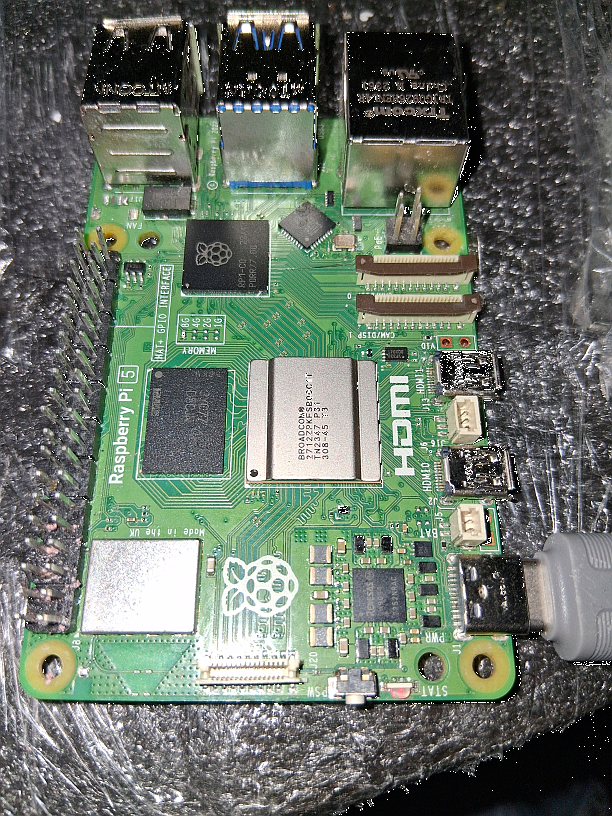
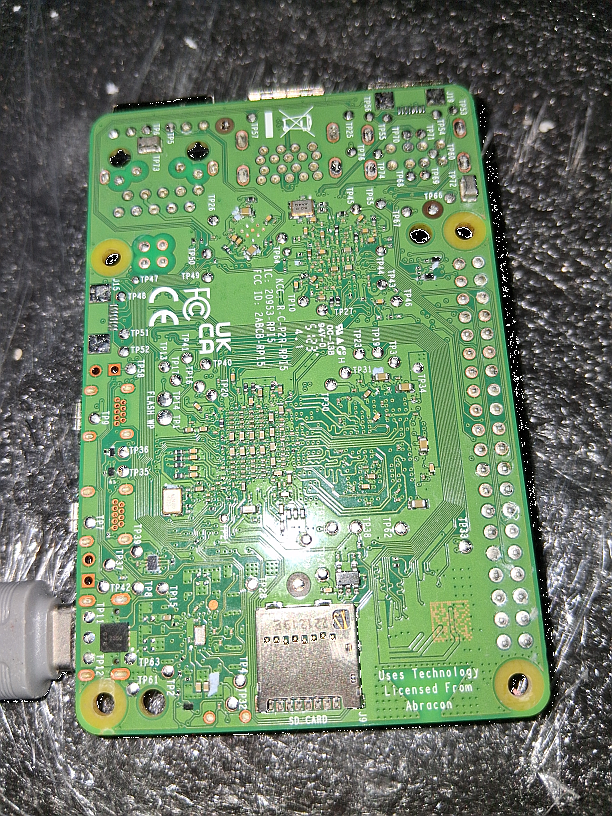
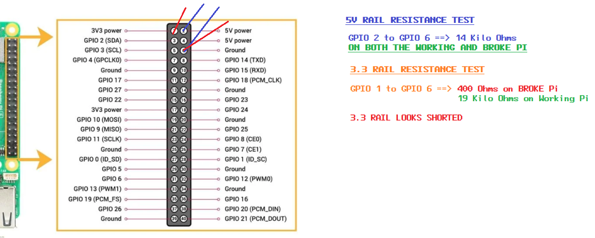

# Pi 5 NOT BOOTING

Since this morning, one og my Raspberry Pi 5 is not booting.

I have 2 Raspberry Pi 5:
   the problematic one is a Pi 5 with 8Gb that I will identify as pi-broke
   I have another, functional Pi 5 with 2Gb that I will identify as pi-work, I used the latter is comparison tests mentionned below

## 1. Configuration

pi-broke was loading Ubuntu Server from a SD card.

## 2. Symptom

I removed all peripherals, left the SD card, and a USBC for power.
Plug in USB-C, the power LED stays solid red. Pressing the power button does nothing. The board never reaches green, never boots.

## 3. Tests

### 3.1 Swap Test

Swap the SD card to the working pi: It boots.

Note: the SD card holds the OS, not the bootloader. The bootloader lives in the board's onboard SPI EEPROM. A card swap tells you nothing about EEPROM state.

### 3.2 Hard Drain and Minimal Config

Clears a PMIC that latched into a protective state on an overcurrent or thermal event.

1. Unplug everything.
2. Hold the power button ~10s to bleed residual charge.
3. Replug with no SD card and no peripherals.
4. Watch the LED.


### 3.3 Visual Inspection

Inspect both sides of the board for defects, damages or burn marks: It's all good, see pictures.




### 3.4 Test 5V Input Rail Resistance -- GOOD
	
**Dead board. USB-C unplugged, SD card out, nothing connected.** Resistance measurements are always done unpowered.

DMM in ohms mode, probe:

```
GPIO pin 2 (5V)  to  GPIO pin 6 (GND)
```

Compare against a known-good board.

| Reading | Meaning |
|---|---|
| ~24 kΩ (reference, known-good) | 3.3V rail clean. |

We get about 20 K Ohms on both.


### 3.5 Test D: 3.3V Rail Resistance - ERROR

Probing: 
```
GPIO pin 1 (3V3)  to  GPIO pin 6 (GND)
```
Compare against a known-good board (pi-work)

| Reading | Meaning |
|---|---|
| ~24 kΩ (reference, known-good) | 3.3V rail clean. |
| Large discrepancy vs good board, e.g. ~400 Ω | 3.3V rail shorted or partially shorted. This is the fault. |

There's a partial short (e.g. ~393 Ω vs ~24 kΩ good):

- Not a dead 0 Ω short, so the PMIC output FET is not fused closed.
- A resistive pull-down on the rail. Most likely a failed decoupling ceramic (MLCC) gone leaky or partially shorted, a classic post-thermal-cycle failure. Less likely, a 3.3V peripheral IC failed internally.
- Prognosis shifts from "scrap" to "potentially repairable," because a shorted cap is findable and removable.

